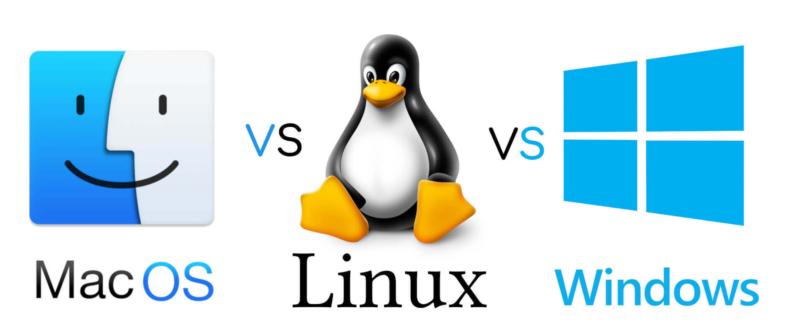

# Linux_Win_Mac_learning
😀Dedicated to taking notes on the underlying operating system.

😘 After going over C again, try tailoring the kernel.

😅Notes are messy, I will sort them out when I have time.



- 如果要你要使用移动存储设备，文件格式必须是exFAT格式，否则无法兼容MacOs，Linux，windows
# release version tip
```
以下是关于这些不同计算机体系结构的简要介绍：
amd64：也称为 x86-64，是一种64位x86体系结构。它是当前PC和服务器中最常见的体系结构之一，大多数个人电脑和服务器都可以使用此体系结构。

arm64：也称为ARMv8-A，是ARM处理器的64位扩展。这种体系结构广泛用于移动设备、嵌入式系统和服务器等领域。它提供了较高的能效和性能。

armhf：也称为ARMv7-A硬浮点，是ARM处理器的32位硬浮点扩展。这种体系结构用于一些旧版的ARM处理器，较新的ARM处理器通常会使用arm64体系结构。

ppc64el：也称为PowerPC 64 Little Endian，是PowerPC处理器的64位版本。该体系结构被广泛应用于服务器和高性能计算领域。

riscv64：RISC-V是一个开源的指令集架构（ISA），目标是成为一种通用的计算机体系结构。riscv64表示RISC-V的64位版本。

s390x：是IBM主机（IBM System z）的64位体系结构。这种体系结构主要用于大型企业应用和高性能计算。

x86：也称为IA-32，是x86家族的32位指令集体系结构。在早期的个人电脑中广泛使用，现在仍然被某些应用程序和操作系统支持。

MIPS：MIPS指令集体系结构主要用于嵌入式系统和嵌入式处理器。它具有精简和高效的特点，适用于一些低功耗和资源受限的应用。

SPARC：SPARC（Scalable Processor ARChitecture）是由Sun Microsystems开发的64位指令集架构。它主要用于高性能计算和服务器领域。

Itanium：Itanium是英特尔和惠普公司共同开发的64位指令集架构。然而，由于市场反应不佳，该体系结构已停止后续开发。

AVR：AVR（Advanced Virtual RISC）是一种8位的低功耗微控制器（MCU）指令集架构。它被广泛应用于嵌入式系统和物联网（IoT）设备。

ARMv6：这是旧版的ARM架构，常见于低功耗的嵌入式系统和物联网设备。

OpenRISC：这是一个开放的32位和64位RISC架构，以自由和开放源代码的形式提供，并广泛应用于嵌入式系统。

SuperH：SuperH（或SH）架构是用于嵌入式系统的32位RISC架构，由日本的Hitachi和Renesas共同开发。

Xtensa：Xtensa架构是用于嵌入式处理器的可扩展32位和64位RISC架构，由Tensilica（Cadence设计系统公司的一部分）开发。

MicroBlaze：MicroBlaze是Xilinx FPGA（现场可编程门阵列）上基于32位RISC架构的软核处理器。
```

# Linux系统架构

Linux，全称GNU/Linux，是一套免费使用和自由传播的操作系统，支持类UNIX、POSIX标准接口，也支持多用户、多进程、多线程，可以在多CPU的机器上运行。由于互联网的发展，Linux吸引了来自全世界各地软件爱好者、科技公司的支持，它已经从大型机到服务器蔓延至个人电脑、嵌入式系统等领域。

Linux系统性能稳定且开源。在很多公司企业网络中被当作服务器来使用，这是Linux的一大亮点，也是它得以壮大的关键。

Linux的基本思想是一切都是文件：每个文件都有确定的用途，包括用户数据、命令、配置参数、硬件设备等对于操作系统内核而言，都被视为各种类型的文件。Linux支持多用户，各个用户对于自己的文件有自己特殊的权利，保证了各用户之间互不影响。多任务则是现代操作系统最重要的一个特点，Linux可以使多个程序同时并独立地运行。

Linux发展到今天，不是哪一个人能做到的，更不是一群计算机黑客能做到的，而是由很多世界级的顶尖科技公司联合开发，如IBM、甲骨文、红帽、英特尔、微软，它们开发Linux并向Linux社区提供补丁，使Linux工作在它们的服务器上，向客户出售业务服务。

Linux发展到今天其代码量近2000万行，可以用浩如烟海来形容，没人能在短时间内弄清楚。

宏内核架构。性能高，但是模块多且模块之间没有隔离。


## 环境变量 


### 最好的shell：
https://ohmyz.sh/
必用主题：bira
必装插件：zsh-autosuggestions git ag cp autojump


### 常见的环境变量文件
1. **/etc/environment:**
    
    - 这个文件是系统范围的全局环境变量文件，对所有用户生效。
    - 该文件包含了系统级别的环境变量设置。
2. **/etc/profile:**
    
    - 当用户登录时，该文件被执行。
    - 可以用于设置全局的环境变量，对所有用户生效。
3. **/etc/bash.bashrc:**
    
    - 用于设置bash shell的全局配置，包括环境变量。
    - 在交互式非登录shell中执行。
4. **~/.bash_profile, ~/.bash_login, ~/.profile:**
    
    - 这些文件通常用于用户特定的配置，当用户登录时执行。
    - 一般情况下，它们是互斥的，即只有其中一个会被执行，优先级为`~/.bash_profile` > `~/.bash_login` > `~/.profile`。
5. **~/.bashrc:**
    
    - 该文件包含bash shell的个人配置，对每个交互式shell生效。
    - 在交互式非登录shell中执行。
6. **~/.bash_logout:**
    
    - 当用户退出登录时执行。
7. **~/.pam_environment:**
    
    - 是一个由PAM (Pluggable Authentication Modules) 管理的文件，用于设置用户环境变量。
    - 该文件允许用户在登录时设置环境变量。


这些文件中的环境变量设置在系统启动、用户登录或shell启动时被加载和执行。请注意，有些文件是系统级别的，而另一些是用户级别的。


### 常见的命令文件夹

1. **/bin:~/bin**
    
    - 存放系统启动时需要的基本命令。
2. **/sbin:**
    
    - 存放供系统管理员使用的系统管理命令，这些命令通常需要超级用户权限。
3. **/usr/bin:**
    
    - 存放用户级的可执行程序，这些程序可以被系统中所有用户使用。
4. **/usr/sbin:**
    
    - 类似于 `/usr/bin`，但存放的是系统管理员使用的系统管理命令。
5. **/usr/local/bin:usr/.local/bin**
    
    - 通常用户自行安装的软件的可执行文件会存放在这里。
6. **/opt:**
    
    - 一些第三方软件可能会安装到这个目录。


## 用户态和内核态

## 内核地图


## 接口
符合标准是Linux内核内部的普遍策略。另一个规则是Linux内核主线不接受只由专有用户空间软件使用的内核模块。

区分四种接口：两种内核内部，两种在内核和用户空间之间。


源代码可移植性确保符合标准的C程序可以在符合同样标准的任何系统上编译和运行。Linux内核开发、[GNU C函数库](https://zh.wikipedia.org/wiki/GNU_C%E5%87%BD%E6%95%B0%E5%BA%93 "GNU C函数库")和相关的实用工具致力于追随[POSIX](https://zh.wikipedia.org/wiki/POSIX "POSIX")和[单一UNIX规范](https://zh.wikipedia.org/wiki/%E5%8D%95%E4%B8%80UNIX%E8%A7%84%E8%8C%83 "单一UNIX规范")。[Linux内核API](https://zh.wikipedia.org/w/index.php?title=Linux%E5%86%85%E6%A0%B8API&action=edit&redlink=1)是内核的[系统调用](https://zh.wikipedia.org/wiki/%E7%B3%BB%E7%BB%9F%E8%B0%83%E7%94%A8 "系统调用")接口。

二进制可移植性将保证任何程序在符合标准的给定硬件平台上一旦编译通过，可以在符合同样标准的任何其他硬件平台上以编译后的形式运行。二进制可移植性是在基于Linux内核的操作系统上建造[独立软件供应商](https://zh.wikipedia.org/wiki/%E7%8B%AC%E7%AB%8B%E8%BD%AF%E4%BB%B6%E4%BE%9B%E5%BA%94%E5%95%86 "独立软件供应商")（ISV）应用有商业可行性的本质要求。现有唯一的二进制兼容标准是[Linux标准规范](https://zh.wikipedia.org/wiki/Linux%E6%A0%87%E5%87%86%E8%A7%84%E8%8C%83 "Linux标准规范")（LSB）。

在不同子系统间使用了数个内核内部API。其中一些是跨越多个发行版保持稳定的，另一些则不然。对于内核内API不作担保。维护者和贡献者可以在任何时候增加或变更它们。

内核内API的例子包括针对下列类别设备驱动程序的软件框架/API：

- [Video4Linux](https://zh.wikipedia.org/wiki/Video4Linux "Video4Linux") – 用于视频捕捉硬件。
- [高级Linux声音体系](https://zh.wikipedia.org/wiki/ALSA "ALSA")（ALSA） – 用于[声卡](https://zh.wikipedia.org/wiki/%E5%A3%B0%E5%8D%A1 "声卡")。
- [New API](https://zh.wikipedia.org/w/index.php?title=New_API&action=edit&redlink=1) – 用于[网络接口控制器](https://zh.wikipedia.org/wiki/%E7%BD%91%E5%8D%A1 "网卡")。
- [直接渲染管理器](https://zh.wikipedia.org/wiki/%E7%9B%B4%E6%8E%A5%E6%B8%B2%E6%9F%93%E7%AE%A1%E7%90%86%E5%99%A8 "直接渲染管理器") – 用于[图形加速器](https://zh.wikipedia.org/wiki/%E5%9C%96%E5%BD%A2%E8%99%95%E7%90%86%E5%99%A8 "图形处理器")。
- [KMS驱动器](https://zh.wikipedia.org/w/index.php?title=KMS%E9%A9%B1%E5%8A%A8%E5%99%A8&action=edit&redlink=1) – 用于[视频显示控制器](https://zh.wikipedia.org/w/index.php?title=%E8%A7%86%E9%A2%91%E6%98%BE%E7%A4%BA%E6%8E%A7%E5%88%B6%E5%99%A8&action=edit&redlink=1)。
- [mac80211](https://zh.wikipedia.org/w/index.php?title=Mac80211&action=edit&redlink=1 "Mac80211（页面不存在）") – 用于[无线网络接口控制器](https://zh.wikipedia.org/wiki/%E6%97%A0%E7%BA%BF%E7%BD%91%E5%8D%A1 "无线网卡")

Linux内核开发者选择不维护稳定的内核内ABI。

## 任务调度


Linux内核提供在特定条件下的抢先式调度。直到内核版本2.4，只有用户进程是抢先式的，就是说除了时间片用尽，在用户模式下执行的当前进程，如果有更高态优先级的进程进入TASK_RUNNING状态，它就会被中断[47]。自从2.6系列Linux内核，增加了中断执行内核代码的任务的能力，但不是对于内核代码的所有段落[48]。

Linux内核含有不同的调度器类[49]。内核缺省使用的调度机制叫做完全公平调度器，它介入于内核版本2.6.23[50]。这个缺省调度器类在内部也叫做SCHED_OTHER，而内核还含有两个遵循POSIX的实时调度类[51]，分别叫做SCHED_FIFO（实时先进先出）和SCHED_RR（实时轮流式），二者都优先于缺省类[49]。

通过使用实时Linux内核补丁PREEMPT_RT，可以支持对关键段落、中断处理器和“中断禁用”代码序列的完全抢先[52]。 实时Linux内核补丁部分地集成入主线内核已经带给它一些功能[53]。抢先机制改善延迟、增进响应性，并使得Linux更加适合桌面和实时应用。老版本内核有所谓的巨锁，用于锁定粒度为整个内核的同步，它最终由Arnd Bergmann在2011年移除了[54]。

还有叫做SCHED_DEADLINE的调度策略，实现了最近截止期限最先（EDF）算法，它增加于2014年3月30日发行的内核版本。
# Windows系统架构

从 MS-DOS 到 Windows NT 保留了很多dos的语法。。。 现在 powershell 就好很多。

- MS-DOS，它的交互方式是你在键盘上输入相应的功能命令，它完成相应的功能后给用户返回相应的操作信息，没有图形界面。
- Windows NT，是微软于1993年推出的面向工作站、网络服务器和大型计算机的网络操作系统，也可做PC操作系统。它是一款全新从零开始开发的新操作系统，并应用了现代硬件的所有特性，“NT”所指的便是“新技术”（New Technology）。

普通用户第一次接触基于NT内核的Windows是Windows 2000，一开始用户其实是不愿意接受的，因为Windows 2000对用户的硬件和应用存在兼容性问题。

随着硬件厂商和应用厂商对程序的升级，这个兼容性问题被缓解了，加之Windows 2000的高性能、高稳定性、高安全性，用户很快便接受了这个操作系统。这可以从Windows 2000的迭代者Windows XP的巨大成功，得到验证。

现在，NT内核在设计上层次非常清晰明了，各组件之间界限耦合程度很低。


## 内核态和用户态


图中我们只关注内核模式下的东西，也就是传统意义上的内核。

当然微软自己在HAL层上是定义了一个小内核，小内核之下是硬件抽象层HAL，这个HAL存在的好处是：不同的硬件平台只要提供对应的HAL就可以移植系统了。小内核之上是各种内核组件，微软称之为内核执行体，它们完成进程、内存、配置、I/O文件缓存、电源与即插即用、安全等相关的服务。

每个执行体互相独立，只对外提供相应的接口，其它执行体要通过内核模式可调用接口和其它执行体通信或者请求其完成相应的功能服务。所有的设备驱动和文件系统都由I/O管理器统一管理，驱动程序可以堆叠形成I/O驱动栈，功能请求被封装成I/O包，在栈中一层层流动处理。

Windows引以为傲的图形子系统也在内核中。

显而易见，NT内核中各层次分明，各个执行体互相独立，这种“高内聚、低偶合”的特性，正是检验一个软件工程是否优秀的重要标准。而这些你都可以通过微软公开的WRK代码得到佐证，如果你觉得WRK代码量太少，也可以看一看REACT OS这个号称“开源版”的NT。

## 任务调度

Windows NT是占先式多任务操作系统，这意味着操作系统不必等待一个线程,它可主动将处理器让给其它线程。在这种方式下,当一个线程已运行了配额的时间后，或出现抢先情况时，操作系统将中断该线程。如图所示：


线程转让CPU处理时间是被迫的。占先式多任务可以防止线程独占CPU,允许其它线程公平地分享CPU执行时间,这和16位Windows环境下的协作式多任务有着本质的区别。在16位Windows环境下,如果一个程序进入无限循环,则其它应用程序可能永远没有机会执行;而在Windows NT环境下这种情况不会发生,相反,许多线程的执行部分都采用了循环扫描的结构。这也是实现了多线程的基础。

# MacOS系统架构

只需要关注内核层和用户转换层。

Mach内核是卡耐基梅隆大学开发的经典微内核，意在提供最基本的操作系统服务，从而达到高性能、安全、可扩展的目的，而BSD则是伯克利大学开发的类UNIX操作系统，提供一整套操作系统服务。

MAC OS X（2011年之前的称呼）的发展经过了不同时期，随着时代的进步，产品功能需求增加，单纯的Mach之上实现出现了性能瓶颈，但是为了兼容之前为Mach开发的应用和设备驱动，就保留了Mach内核，同时加入了BSD内核。

Mach内核仍然提供十分简单的进程、线程、IPC通信、虚拟内存设备驱动相关的功能服务，BSD则提供强大的安全特性，完善的网络服务，各种文件系统的支持，同时对Mach的进程、线程、IPC、虚拟内核组件进行细化、扩展延伸。

那么应用如何使用Darwin系统的服务呢？应用会通过用户层的框架和库来请求Darwin系统的服务，即调用Darwin系统API。

在调用Darwin系统API时，会传入一个API号码，用这个号码去索引Mach陷入中断服务表中的函数。此时，API号码如果小于0，则表明请求的是Mach内核的服务，API号码如果大于0，则表明请求的是BSD内核的服务，它提供一整套标准的POSIX接口。

就这样，Mach和BSD就同时存在了。

Mach中还有一个重要的组件Libkern，它是一个库，提供了很多底层的操作函数，同时支持C++运行环境。

依赖这个库的还有IOKit，IOKit管理所有的设备驱动和内核功能扩展模块。驱动程序开发人员则可以使用C++面向对象的方式开发驱动，这个方式很优雅，你完全可以找一个成熟的驱动程序作为父类继承它，要特别实现某个功能就重载其中的函数，也可以同时继承其它驱动程序，这大大节省了内存，也大大降低了出现BUG的可能。
## XNU内核架构


- XNU 由 `Mach`、`BSD`、`IOKit(驱动API)` 组成。
- Mach 和 BSD 各自负责如图所示的系统不同的工作


### Mach

Mach 是`微内核`，微内核可以提高系统的`模块化`程度，提供`内存保护`的消息传递机制。

### BSD

BSD是对 Mach再次`封装`的`宏内核`, 提供了更现代、更易用的内核接口

`宏内核`也叫单内核，性能更高, 在高负荷状态时依然保持`高效`运作。

### BSD符合POSIX标准

IEEE 为了保证软件在各个 UNIX 系统上运行而制定了`POSIX`标准，iOS 通过`BSD`对 POSIX 的兼容而成为了`类 UNIX 系统`。

比如BSD 会构建UNIX进程模型，创建POSIX兼容的线程模型`pthread`。

### 进程

`Mach`

进程在Mach中表示为Task，`Mach Task`是线程执行的环境和容器。

用户态通过 mach_msg_trap() 函数触发陷阱，切换至 Mach 内核态，由 Mach 里的 mach_msg() 函数完成`进程间通信`。

Mach 使用 mach_msg_trap() 函数触发陷阱来处理`异常消息`，

`BSD`

进程在BSD中表示为Process，`BSD Process`扩展了 `Mach Task`，`增加`了`进程 ID`、`信号`信息等，。

BSD 在Mach`异常消息`机制的基础上建立了`信号处理`机制，用户态产生的信号会先被 Mach 转换成异常，BSD 将异常再转换成`信号`。

### 线程

Mach Thread 表示一个线程，是 Mach 里的最小执行单位。Mach Thread 有自己的状态，包括机器状态、线程栈、调度优先级、调度策略、内核 Port、异常 Port。

Mach Thread 也可以扩展为 `Uthread`，通过 `BSD Process`` 处理。

### IOKit

IOKit 是硬件`驱动程序`的运行环境，包含电源、内存、CPU 等信息。

IOKit 底层 libkern 使用 C++ 子集 Embedded C++ 编写了驱动程序基类，比如 OSObject、OSArray、OSString 等，新驱动可以继承这些基类来写。


## IOS系统架构
从上到下分为四层：

- 用户体验层
- 应用框架层，是`App开发`会用到的
- 核心框架层。
- Darwin 层，是iOS系统的`核心`，属于内核态。

Darwin 的内核是 XNU，XNU 是在 `UNIX` 的基础上做了很多改进以及创新。

### MacOS架构图


# 线程&进程调度算法

线程调度算法是操作系统中用来管理和调度进程或线程的一种技术，它的主要目的是优化系统资源的利用，提高系统的响应速度和效率。常见的线程调度算法有以下几种：

1. 先来先服务（FCFS）调度算法：按照请求的先后顺序，按照队列的先进先出规则来进行调度。该算法简单、公平，但可能会导致后面的线程等待时间过长，影响系统的响应速度。

2. 最短作业优先（SJF）调度算法：按照线程的执行时间长短来进行调度。该算法可以保证短作业先完成，从而提高系统的响应速度和效率，但如果长作业一直出现，可能会导致短作业一直等待，降低系统的响应速度。

3. 时间片轮转（RR）调度算法：将线程分配固定的时间片，当时间片用完时，将线程放入队列的尾部等待下一次调度。该算法可以保证公平性，使得所有线程都能获得一定的CPU时间，但如果时间片过短，可能会导致频繁的线程切换，降低系统的响应速度。

4. 优先级调度算法：按照线程的优先级来进行调度，优先级高的线程先被调度。该算法可以根据不同线程的重要性和紧急程度来分配CPU时间，但如果优先级设计不当，可能会导致低优先级的线程一直等待，影响系统的响应速度。

6. 多级反馈队列调度算法：将线程分配到不同的队列中，每个队列有不同的优先级和时间片长度，线程可以根据自己的执行情况在不同队列之间移动。该算法可以结合前面几种算法的优点，既保证了短作业的优先完成，又可以公平地分配CPU时间，提高系统的响应速度和效率。

7. 非抢占式优先权算法：在这种方式下，系统一旦把处理机分配给就绪队列中优先权最高的进程后，该进程便一直执行下去，直至完成；或因发生某事件使该进程放弃处理机时。这种调度算法主要用于批处理系统中，也可用于某些对实时性要求不严的实时系统中。

8. 抢占式优先权调度算法：在这种方式下，系统同样是把处理机分配给优先权最高的进程，使之执行。但在其执行期间，只要又出现了另一个其优先权更高的进程，进程调度就立即停止当前进程（原优先权最高的进程）的执行，重新将处理机分配给新到的优先权最高的进程。显然，这种抢占式的优先权调度算法能更好地满足紧迫作业的要求，故而常用于比较严格的实时系统中，以及对性能要求较高的批处理系统和分时系统中。

9. 高响应比优先调度算法：在批处理系统中，短作业优先算法是一种比较好的算法，其主要的不足之处是长作业的运行得不到保证。如果我们能为每个作业引入前面所述的动态优先权，并使作业的优先级随着等待时间的增加而以速率a提高，则长作业在等待一定时间后，必然有机会分配到处理机。该优先权的变化规律可描述为：

　　　　

　　　　a. 如果作业地等待时间相同，则要求服务的时间愈短，其优先权愈高，因而该算法有利于短作业。

　　　　b. 当要求服务的时间相同时，作业的优先权决定与其等待时间，等待时间越长，其优先权越高，因而它实现的是先来先服务。

　　　　c. 对于长作业，作业的优先级可以随等待时间的增加而增加，当其等待时间足够长时，其优先级便可升到很高，从而也可获得处理机。该算法既照顾了短作业，又考虑了作业到达的先后次序，不会使长作业长期得不到服务。因此，该算法实现了一种较好的折中。当然，在利用该算法时，每要进行调度之前按，都须先做响应比的计算，这会增加系统开销。


## 对于开发而言

```markdown
"并行"和"并发"是计算机科学中两个相关但不同的概念。

# 并行前置条件：多处理器 or 分布式系统 or 多虚拟化系统，但同一时间能处理多个任务。
并行（Parallelism）：
定义： 并行是指同时执行多个任务。这意味着在同一时刻，多个任务在不同的处理器上或多个计算资源上同时执行。
实现方式： 多核处理器、多处理器系统或分布式系统都是实现并行的方式。每个任务拥有自己的执行线程或进程，它们可以同时运行，提高整体系统的处理能力。
例子： 如果有两个任务 A 和 B，它们在同时执行且不相互干扰，这就是并行。比如，一个多核处理器上同时运行两个独立的程序。

# 并发条件：单处理器，切换处理任务，但同一时间只能处理一个任务。
并发（Concurrency）：
定义： 并发是指多个任务交替执行，但不一定是同时执行。在同一时间段内，系统可能会处理多个任务，通过快速切换来模拟同时运行的效果。
实现方式： 通常通过线程、进程或事件驱动的方式来实现。这样的设计可以提高系统的响应性，即使某个任务阻塞，其他任务仍然可以继续执行。
例子： 一个单核处理器上通过时间片轮转方式执行多个任务，它们交替执行，但在任意时刻只有一个任务在执行。

# 并发的简单实现方式
关于协程（Coroutine）：
定义： 协程是一种轻量级的线程，可以在执行过程中暂停并让出执行权给其他协程，然后在适当的时候恢复执行。协程通常在单个线程内执行，并使用协作式调度而不是抢占式调度。
关系： 协程通常与并发概念一起使用，因为多个协程可以在同一时间段内交替执行，实现并发。与并行不同，协程的并发通常在单个线程内部进行，而不需要多个物理处理器。协程可以用于简化并发编程，并且在某些情况下可以更高效地利用系统资源。
总体而言，虽然并行和并发都涉及多任务处理，但并行更强调同时执行，而并发更强调任务之间的交替执行。协程是一种实现并发的机制，可以在单个线程内管理多个协程的执行。
```

多进程并行，并发。

多线程并行,，并发。

异步并发。


